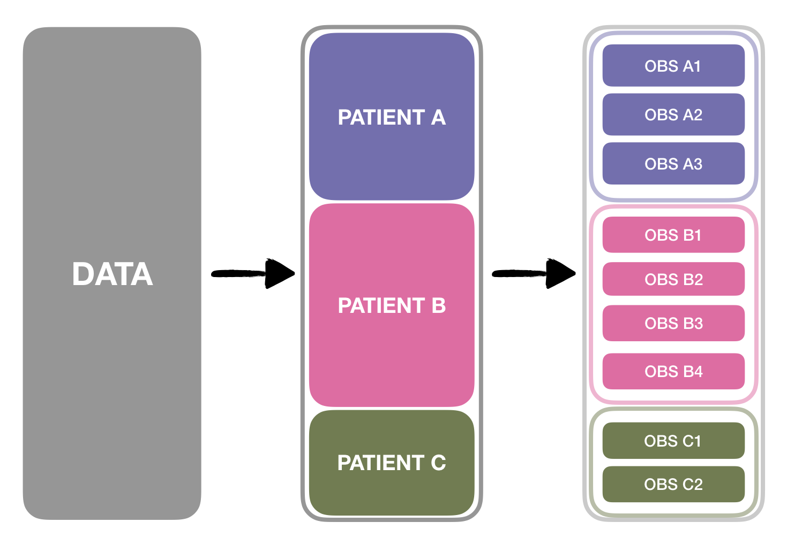
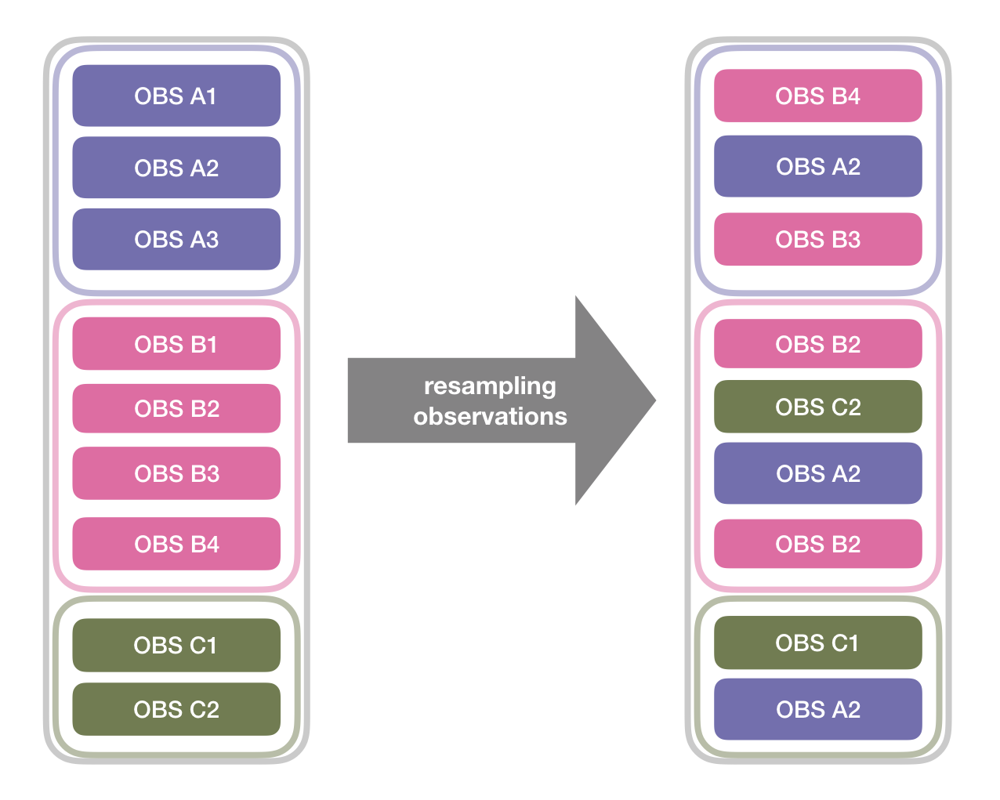
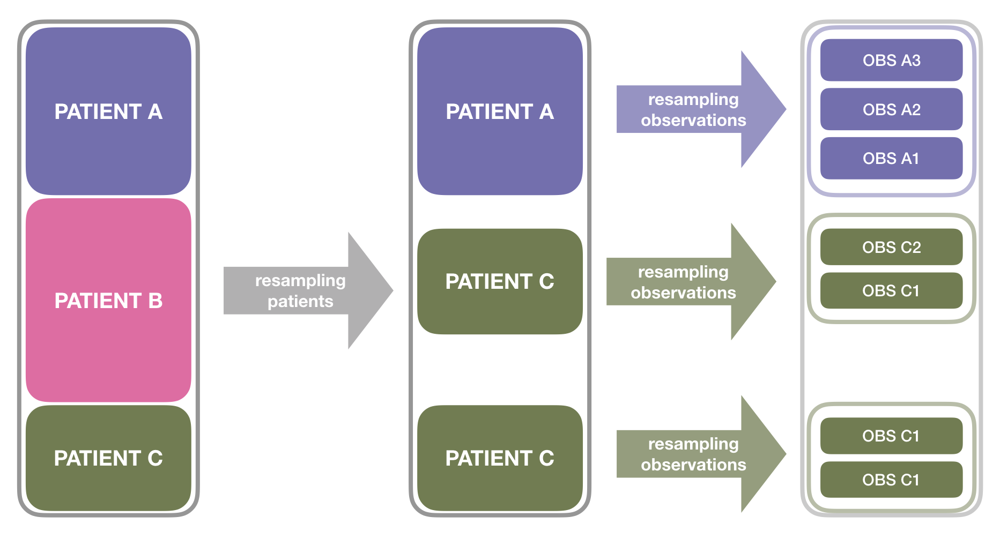

class: center, middle

# Joint Work

---
class: center, middle

# _(Co)-Starring:_

---
class: center

# _(Co)-Starring:_
.column[

### Eva Cantoni


]

.column[

### Stephane Heritier


]

.column[

### Rory Wolfe


]

---
# Outline

1. **Clustered Data**

2. **Bootstrapping** Clustered Data

3. Bootstrapping Clustered Data via a **Weighted Laplace Approximation**

4. (Some) Properties

5. Discussion and Current Work

---
class: inverse, center, middle

```{r , include = FALSE}
knitr::opts_chunk$set(
    # fig.width=5,
    # fig.height=5,
    # out.width = '0.95\\linewidth',
    echo =FALSE, 
    cache = TRUE, 
    message = FALSE,
    # results = 'hide', 
    warning = FALSE,
    global.par = TRUE)

# Primary Color Palette
pal_monashblue  <- "#006DAE"
pal_black       <- "#000000"
pal_white       <- "#FFFFFF"
pal_darkgrey    <- "#5A5A5A"
pal_grey        <- "#969696"
pal_lightGrey   <- "#E6E6E6"

# Secondary Color Palette

pal_blue        <- "#027EB6"
pal_burple      <- "#746FB2"
pal_fuchsia     <- "#9651A0"
pal_ruby        <- "#C8008F"
pal_pink        <- "#EE64A4"
pal_red         <- "#EE0220"
pal_orange      <- "#D93F00"
pal_umber       <- "#795549"
pal_olive       <- "#6F7C4D"
pal_green       <- "#008A25"
```

```{r}
library(plyr)
library(reshape)
library(lme4)
library(ggplot2)
library(dplyr)
library(xtable)
```

```{r, include = FALSE}
## ----source_tn_GLMM_all, include  = FALSE--------------------------------

# P1 : ng = 300, ni = 7

ni  <- 7
ng  <- 300  # Number of groups

n = ni*ng
B = 1000

M = 1000

filenames <- paste(
  paste(
    "~/Dropbox/Paper/Codes/GLMM/GLMM_OneWay/[Baobab]/[Ch2]/chunks/pregcb_tn_aq","ni",n/ng,"ng",ng,"B",B,"M", M ,sep="_"
  ),
  '.RData',sep='')

try(load(file = filenames), silent=TRUE)

b_1_mle_s1 = bs.mer[,1]
b_2_mle_s1 = bs.mer[,2]
b_3_mle_s1 = bs.mer[,3]
b_4_mle_s1 = bs.mer[,4]

b_1_gcb_s1 = as.vector(bs.gcb.mer[,, 1])
b_2_gcb_s1 = as.vector(bs.gcb.mer[,, 2])
b_3_gcb_s1 = as.vector(bs.gcb.mer[,, 3])
b_4_gcb_s1 = as.vector(bs.gcb.mer[,, 4])

b_1_pmb_s1 = as.vector(bs.pmb.mer[,, 1])
b_2_pmb_s1 = as.vector(bs.pmb.mer[,, 2])
b_3_pmb_s1 = as.vector(bs.pmb.mer[,, 3])
b_4_pmb_s1 = as.vector(bs.pmb.mer[,, 4])

b_1_rebcmv1_s1 = as.vector(bs.cm.rebv1.mer[,, 1])
b_2_rebcmv1_s1 = as.vector(bs.cm.rebv1.mer[,, 1])
b_3_rebcmv1_s1 = as.vector(bs.cm.rebv1.mer[,, 1])
b_4_rebcmv1_s1 = as.vector(bs.cm.rebv1.mer[,, 1])

b_1_rebcmv2_s1 = as.vector(bs.cm.rebv2.mer[,, 1])
b_2_rebcmv2_s1 = as.vector(bs.cm.rebv2.mer[,, 1])
b_3_rebcmv2_s1 = as.vector(bs.cm.rebv2.mer[,, 1])
b_4_rebcmv2_s1 = as.vector(bs.cm.rebv2.mer[,, 1])

b_1_rebepv1_s1 = as.vector(bs.ep.rebv1.mer[,, 1])
b_2_rebepv1_s1 = as.vector(bs.ep.rebv1.mer[,, 1])
b_3_rebepv1_s1 = as.vector(bs.ep.rebv1.mer[,, 1])
b_4_rebepv1_s1 = as.vector(bs.ep.rebv1.mer[,, 1])

b_1_rebepv2_s1 = as.vector(bs.ep.rebv2.mer[,, 1])
b_2_rebepv2_s1 = as.vector(bs.ep.rebv2.mer[,, 1])
b_3_rebepv2_s1 = as.vector(bs.ep.rebv2.mer[,, 1])
b_4_rebepv2_s1 = as.vector(bs.ep.rebv2.mer[,, 1])

s2_mle_s1  = s2.mer
s2_gcb_s1  = as.vector(s2.gcb.mer)
s2_pmb_s1  = as.vector(s2.pmb.mer)
s2_rebcmv1_s1  = as.vector(s2.cm.rebv1.mer)
s2_rebcmv2_s1  = as.vector(s2.cm.rebv2.mer)
s2_rebepv1_s1  = as.vector(s2.ep.rebv1.mer)
s2_rebepv2_s1  = as.vector(s2.ep.rebv2.mer)

qqb_1_gcb_s1        <-qqplot(b_1_mle_s1, b_1_gcb_s1, plot.it = FALSE)
qqb_1_pmb_s1        <-qqplot(b_1_mle_s1, b_1_pmb_s1, plot.it = FALSE)
qqb_1_rebcmv1_s1    <-qqplot(b_1_mle_s1, b_1_rebcmv1_s1, plot.it = FALSE)
qqb_1_rebcmv2_s1    <-qqplot(b_1_mle_s1, b_1_rebcmv2_s1, plot.it = FALSE)
qqb_1_rebepv1_s1    <-qqplot(b_1_mle_s1, b_1_rebepv1_s1, plot.it = FALSE)
qqb_1_rebepv2_s1    <-qqplot(b_1_mle_s1, b_1_rebepv2_s1, plot.it = FALSE)

qqb_2_gcb_s1        <-qqplot(b_2_mle_s1, b_2_gcb_s1, plot.it = FALSE)
qqb_2_pmb_s1        <-qqplot(b_2_mle_s1, b_2_pmb_s1, plot.it = FALSE)
qqb_2_rebcmv1_s1    <-qqplot(b_2_mle_s1, b_2_rebcmv1_s1, plot.it = FALSE)
qqb_2_rebcmv2_s1    <-qqplot(b_2_mle_s1, b_2_rebcmv2_s1, plot.it = FALSE)
qqb_2_rebepv1_s1    <-qqplot(b_2_mle_s1, b_2_rebepv1_s1, plot.it = FALSE)
qqb_2_rebepv2_s1    <-qqplot(b_2_mle_s1, b_2_rebepv2_s1, plot.it = FALSE)

qqb_3_gcb_s1        <-qqplot(b_3_mle_s1, b_3_gcb_s1, plot.it = FALSE)
qqb_3_pmb_s1        <-qqplot(b_3_mle_s1, b_3_pmb_s1, plot.it = FALSE)
qqb_3_rebcmv1_s1    <-qqplot(b_3_mle_s1, b_3_rebcmv1_s1, plot.it = FALSE)
qqb_3_rebcmv2_s1    <-qqplot(b_3_mle_s1, b_3_rebcmv2_s1, plot.it = FALSE)
qqb_3_rebepv1_s1    <-qqplot(b_3_mle_s1, b_3_rebepv1_s1, plot.it = FALSE)
qqb_3_rebepv2_s1    <-qqplot(b_3_mle_s1, b_3_rebepv2_s1, plot.it = FALSE)

qqb_4_gcb_s1        <-qqplot(b_4_mle_s1, b_4_gcb_s1, plot.it = FALSE)
qqb_4_pmb_s1        <-qqplot(b_4_mle_s1, b_4_pmb_s1, plot.it = FALSE)
qqb_4_rebcmv1_s1    <-qqplot(b_4_mle_s1, b_4_rebcmv1_s1, plot.it = FALSE)
qqb_4_rebcmv2_s1    <-qqplot(b_4_mle_s1, b_4_rebcmv2_s1, plot.it = FALSE)
qqb_4_rebepv1_s1    <-qqplot(b_4_mle_s1, b_4_rebepv1_s1, plot.it = FALSE)
qqb_4_rebepv2_s1    <-qqplot(b_4_mle_s1, b_4_rebepv2_s1, plot.it = FALSE)

qqs2_gcb_s1         <-qqplot(s2_mle_s1, s2_gcb_s1, plot.it = FALSE)
qqs2_pmb_s1         <-qqplot(s2_mle_s1, s2_pmb_s1, plot.it = FALSE)
qqs2_rebcmv1_s1     <-qqplot(s2_mle_s1, s2_rebcmv1_s1, plot.it = FALSE)
qqs2_rebcmv2_s1     <-qqplot(s2_mle_s1, s2_rebcmv2_s1, plot.it = FALSE)
qqs2_rebepv1_s1     <-qqplot(s2_mle_s1, s2_rebepv1_s1, plot.it = FALSE)
qqs2_rebepv2_s1     <-qqplot(s2_mle_s1, s2_rebepv2_s1, plot.it = FALSE)

# P2 : ng = 300, ni = 14

ni  <- 14
ng  <- 300  # Number of groups

n = ni*ng
B = 1000

M = 1000

filenames <- paste(
  paste(
    "~/Dropbox/Paper/Codes/GLMM/GLMM_OneWay/[Baobab]/[Ch2]/chunks/pregcb_tn_aq","ni",n/ng,"ng",ng,"B",B,"M", M ,sep="_"
  ),
  '.RData',sep='')

try(load(file = filenames), silent=TRUE)

b_1_mle_s2 = bs.mer[,1]
b_2_mle_s2 = bs.mer[,2]
b_3_mle_s2 = bs.mer[,3]
b_4_mle_s2 = bs.mer[,4]

b_1_gcb_s2 = as.vector(bs.gcb.mer[,, 1])
b_2_gcb_s2 = as.vector(bs.gcb.mer[,, 2])
b_3_gcb_s2 = as.vector(bs.gcb.mer[,, 3])
b_4_gcb_s2 = as.vector(bs.gcb.mer[,, 4])

b_1_pmb_s2 = as.vector(bs.pmb.mer[,, 1])
b_2_pmb_s2 = as.vector(bs.pmb.mer[,, 2])
b_3_pmb_s2 = as.vector(bs.pmb.mer[,, 3])
b_4_pmb_s2 = as.vector(bs.pmb.mer[,, 4])

b_1_rebcmv1_s2 = as.vector(bs.cm.rebv1.mer[,, 1])
b_2_rebcmv1_s2 = as.vector(bs.cm.rebv1.mer[,, 1])
b_3_rebcmv1_s2 = as.vector(bs.cm.rebv1.mer[,, 1])
b_4_rebcmv1_s2 = as.vector(bs.cm.rebv1.mer[,, 1])

b_1_rebcmv2_s2 = as.vector(bs.cm.rebv2.mer[,, 1])
b_2_rebcmv2_s2 = as.vector(bs.cm.rebv2.mer[,, 1])
b_3_rebcmv2_s2 = as.vector(bs.cm.rebv2.mer[,, 1])
b_4_rebcmv2_s2 = as.vector(bs.cm.rebv2.mer[,, 1])

b_1_rebepv1_s2 = as.vector(bs.ep.rebv1.mer[,, 1])
b_2_rebepv1_s2 = as.vector(bs.ep.rebv1.mer[,, 1])
b_3_rebepv1_s2 = as.vector(bs.ep.rebv1.mer[,, 1])
b_4_rebepv1_s2 = as.vector(bs.ep.rebv1.mer[,, 1])

b_1_rebepv2_s2 = as.vector(bs.ep.rebv2.mer[,, 1])
b_2_rebepv2_s2 = as.vector(bs.ep.rebv2.mer[,, 1])
b_3_rebepv2_s2 = as.vector(bs.ep.rebv2.mer[,, 1])
b_4_rebepv2_s2 = as.vector(bs.ep.rebv2.mer[,, 1])

s2_mle_s2  = s2.mer
s2_gcb_s2  = as.vector(s2.gcb.mer)
s2_pmb_s2  = as.vector(s2.pmb.mer)
s2_rebcmv1_s2  = as.vector(s2.cm.rebv1.mer)
s2_rebcmv2_s2  = as.vector(s2.cm.rebv2.mer)
s2_rebepv1_s2  = as.vector(s2.ep.rebv1.mer)
s2_rebepv2_s2  = as.vector(s2.ep.rebv2.mer)

qqb_1_gcb_s2        <-qqplot(b_1_mle_s2, b_1_gcb_s2, plot.it = FALSE)
qqb_1_pmb_s2        <-qqplot(b_1_mle_s2, b_1_pmb_s2, plot.it = FALSE)
qqb_1_rebcmv1_s2    <-qqplot(b_1_mle_s2, b_1_rebcmv1_s2, plot.it = FALSE)
qqb_1_rebcmv2_s2    <-qqplot(b_1_mle_s2, b_1_rebcmv2_s2, plot.it = FALSE)
qqb_1_rebepv1_s2    <-qqplot(b_1_mle_s2, b_1_rebepv1_s2, plot.it = FALSE)
qqb_1_rebepv2_s2    <-qqplot(b_1_mle_s2, b_1_rebepv2_s2, plot.it = FALSE)

qqb_2_gcb_s2        <-qqplot(b_2_mle_s2, b_2_gcb_s2, plot.it = FALSE)
qqb_2_pmb_s2        <-qqplot(b_2_mle_s2, b_2_pmb_s2, plot.it = FALSE)
qqb_2_rebcmv1_s2    <-qqplot(b_2_mle_s2, b_2_rebcmv1_s2, plot.it = FALSE)
qqb_2_rebcmv2_s2    <-qqplot(b_2_mle_s2, b_2_rebcmv2_s2, plot.it = FALSE)
qqb_2_rebepv1_s2    <-qqplot(b_2_mle_s2, b_2_rebepv1_s2, plot.it = FALSE)
qqb_2_rebepv2_s2    <-qqplot(b_2_mle_s2, b_2_rebepv2_s2, plot.it = FALSE)

qqb_3_gcb_s2        <-qqplot(b_3_mle_s2, b_3_gcb_s2, plot.it = FALSE)
qqb_3_pmb_s2        <-qqplot(b_3_mle_s2, b_3_pmb_s2, plot.it = FALSE)
qqb_3_rebcmv1_s2    <-qqplot(b_3_mle_s2, b_3_rebcmv1_s2, plot.it = FALSE)
qqb_3_rebcmv2_s2    <-qqplot(b_3_mle_s2, b_3_rebcmv2_s2, plot.it = FALSE)
qqb_3_rebepv1_s2    <-qqplot(b_3_mle_s2, b_3_rebepv1_s2, plot.it = FALSE)
qqb_3_rebepv2_s2    <-qqplot(b_3_mle_s2, b_3_rebepv2_s2, plot.it = FALSE)

qqb_4_gcb_s2        <-qqplot(b_4_mle_s2, b_4_gcb_s2, plot.it = FALSE)
qqb_4_pmb_s2        <-qqplot(b_4_mle_s2, b_4_pmb_s2, plot.it = FALSE)
qqb_4_rebcmv1_s2    <-qqplot(b_4_mle_s2, b_4_rebcmv1_s2, plot.it = FALSE)
qqb_4_rebcmv2_s2    <-qqplot(b_4_mle_s2, b_4_rebcmv2_s2, plot.it = FALSE)
qqb_4_rebepv1_s2    <-qqplot(b_4_mle_s2, b_4_rebepv1_s2, plot.it = FALSE)
qqb_4_rebepv2_s2    <-qqplot(b_4_mle_s2, b_4_rebepv2_s2, plot.it = FALSE)

qqs2_gcb_s2         <-qqplot(s2_mle_s2, s2_gcb_s2, plot.it = FALSE)
qqs2_pmb_s2         <-qqplot(s2_mle_s2, s2_pmb_s2, plot.it = FALSE)
qqs2_rebcmv1_s2     <-qqplot(s2_mle_s2, s2_rebcmv1_s2, plot.it = FALSE)
qqs2_rebcmv2_s2     <-qqplot(s2_mle_s2, s2_rebcmv2_s2, plot.it = FALSE)
qqs2_rebepv1_s2     <-qqplot(s2_mle_s2, s2_rebepv1_s2, plot.it = FALSE)
qqs2_rebepv2_s2     <-qqplot(s2_mle_s2, s2_rebepv2_s2, plot.it = FALSE)

# P3 : ng = 300, ni = 21

ni  <- 21
ng  <- 300  # Number of groups


n = ni*ng
B = 1000
M = 1000

filenames <- paste(
  paste(
    "~/Dropbox/Paper/Codes/GLMM/GLMM_OneWay/[Baobab]/[Ch2]/chunks/pregcb_tn_aq","ni",n/ng,"ng",ng,"B",B,"M", M ,sep="_"
  ),
  '.RData',sep='')

try(load(file = filenames), silent=TRUE)

b_1_mle_s3 = bs.mer[,1]
b_2_mle_s3 = bs.mer[,2]
b_3_mle_s3 = bs.mer[,3]
b_4_mle_s3 = bs.mer[,4]

b_1_gcb_s3 = as.vector(bs.gcb.mer[,, 1])
b_2_gcb_s3 = as.vector(bs.gcb.mer[,, 2])
b_3_gcb_s3 = as.vector(bs.gcb.mer[,, 3])
b_4_gcb_s3 = as.vector(bs.gcb.mer[,, 4])

b_1_pmb_s3 = as.vector(bs.pmb.mer[,, 1])
b_2_pmb_s3 = as.vector(bs.pmb.mer[,, 2])
b_3_pmb_s3 = as.vector(bs.pmb.mer[,, 3])
b_4_pmb_s3 = as.vector(bs.pmb.mer[,, 4])

b_1_rebcmv1_s3 = as.vector(bs.cm.rebv1.mer[,, 1])
b_2_rebcmv1_s3 = as.vector(bs.cm.rebv1.mer[,, 1])
b_3_rebcmv1_s3 = as.vector(bs.cm.rebv1.mer[,, 1])
b_4_rebcmv1_s3 = as.vector(bs.cm.rebv1.mer[,, 1])

b_1_rebcmv2_s3 = as.vector(bs.cm.rebv2.mer[,, 1])
b_2_rebcmv2_s3 = as.vector(bs.cm.rebv2.mer[,, 1])
b_3_rebcmv2_s3 = as.vector(bs.cm.rebv2.mer[,, 1])
b_4_rebcmv2_s3 = as.vector(bs.cm.rebv2.mer[,, 1])

b_1_rebepv1_s3 = as.vector(bs.ep.rebv1.mer[,, 1])
b_2_rebepv1_s3 = as.vector(bs.ep.rebv1.mer[,, 1])
b_3_rebepv1_s3 = as.vector(bs.ep.rebv1.mer[,, 1])
b_4_rebepv1_s3 = as.vector(bs.ep.rebv1.mer[,, 1])

b_1_rebepv2_s3 = as.vector(bs.ep.rebv2.mer[,, 1])
b_2_rebepv2_s3 = as.vector(bs.ep.rebv2.mer[,, 1])
b_3_rebepv2_s3 = as.vector(bs.ep.rebv2.mer[,, 1])
b_4_rebepv2_s3 = as.vector(bs.ep.rebv2.mer[,, 1])

s2_mle_s3  = s2.mer
s2_gcb_s3  = as.vector(s2.gcb.mer)
s2_pmb_s3  = as.vector(s2.pmb.mer)
s2_rebcmv1_s3  = as.vector(s2.cm.rebv1.mer)
s2_rebcmv2_s3  = as.vector(s2.cm.rebv2.mer)
s2_rebepv1_s3  = as.vector(s2.ep.rebv1.mer)
s2_rebepv2_s3  = as.vector(s2.ep.rebv2.mer)

qqb_1_gcb_s3        <-qqplot(b_1_mle_s3, b_1_gcb_s3, plot.it = FALSE)
qqb_1_pmb_s3        <-qqplot(b_1_mle_s3, b_1_pmb_s3, plot.it = FALSE)
qqb_1_rebcmv1_s3    <-qqplot(b_1_mle_s3, b_1_rebcmv1_s3, plot.it = FALSE)
qqb_1_rebcmv2_s3    <-qqplot(b_1_mle_s3, b_1_rebcmv2_s3, plot.it = FALSE)
qqb_1_rebepv1_s3    <-qqplot(b_1_mle_s3, b_1_rebepv1_s3, plot.it = FALSE)
qqb_1_rebepv2_s3    <-qqplot(b_1_mle_s3, b_1_rebepv2_s3, plot.it = FALSE)

qqb_2_gcb_s3        <-qqplot(b_2_mle_s3, b_2_gcb_s3, plot.it = FALSE)
qqb_2_pmb_s3        <-qqplot(b_2_mle_s3, b_2_pmb_s3, plot.it = FALSE)
qqb_2_rebcmv1_s3    <-qqplot(b_2_mle_s3, b_2_rebcmv1_s3, plot.it = FALSE)
qqb_2_rebcmv2_s3    <-qqplot(b_2_mle_s3, b_2_rebcmv2_s3, plot.it = FALSE)
qqb_2_rebepv1_s3    <-qqplot(b_2_mle_s3, b_2_rebepv1_s3, plot.it = FALSE)
qqb_2_rebepv2_s3    <-qqplot(b_2_mle_s3, b_2_rebepv2_s3, plot.it = FALSE)

qqb_3_gcb_s3        <-qqplot(b_3_mle_s3, b_3_gcb_s3, plot.it = FALSE)
qqb_3_pmb_s3        <-qqplot(b_3_mle_s3, b_3_pmb_s3, plot.it = FALSE)
qqb_3_rebcmv1_s3    <-qqplot(b_3_mle_s3, b_3_rebcmv1_s3, plot.it = FALSE)
qqb_3_rebcmv2_s3    <-qqplot(b_3_mle_s3, b_3_rebcmv2_s3, plot.it = FALSE)
qqb_3_rebepv1_s3    <-qqplot(b_3_mle_s3, b_3_rebepv1_s3, plot.it = FALSE)
qqb_3_rebepv2_s3    <-qqplot(b_3_mle_s3, b_3_rebepv2_s3, plot.it = FALSE)

qqb_4_gcb_s3        <-qqplot(b_4_mle_s3, b_4_gcb_s3, plot.it = FALSE)
qqb_4_pmb_s3        <-qqplot(b_4_mle_s3, b_4_pmb_s3, plot.it = FALSE)
qqb_4_rebcmv1_s3    <-qqplot(b_4_mle_s3, b_4_rebcmv1_s3, plot.it = FALSE)
qqb_4_rebcmv2_s3    <-qqplot(b_4_mle_s3, b_4_rebcmv2_s3, plot.it = FALSE)
qqb_4_rebepv1_s3    <-qqplot(b_4_mle_s3, b_4_rebepv1_s3, plot.it = FALSE)
qqb_4_rebepv2_s3    <-qqplot(b_4_mle_s3, b_4_rebepv2_s3, plot.it = FALSE)

qqs2_gcb_s3         <-qqplot(s2_mle_s3, s2_gcb_s3, plot.it = FALSE)
qqs2_pmb_s3         <-qqplot(s2_mle_s3, s2_pmb_s3, plot.it = FALSE)
qqs2_rebcmv1_s3     <-qqplot(s2_mle_s3, s2_rebcmv1_s3, plot.it = FALSE)
qqs2_rebcmv2_s3     <-qqplot(s2_mle_s3, s2_rebcmv2_s3, plot.it = FALSE)
qqs2_rebepv1_s3     <-qqplot(s2_mle_s3, s2_rebepv1_s3, plot.it = FALSE)
qqs2_rebepv2_s3     <-qqplot(s2_mle_s3, s2_rebepv2_s3, plot.it = FALSE)

# P4 : ng = 600, ni = 7

ni  <- 7
ng  <- 600  # Number of groups

n = ni*ng
B = 1000
#
M = 1000
#

filenames <- paste(
  paste(
    "~/Dropbox/Paper/Codes/GLMM/GLMM_OneWay/[Baobab]/[Ch2]/chunks/pregcb_tn_aq","ni",n/ng,"ng",ng,"B",B,"M", M ,sep="_"
  ),
  '.RData',sep='')

try(load(file = filenames), silent=TRUE)

b_1_mle_s4 = bs.mer[,1]
b_2_mle_s4 = bs.mer[,2]
b_3_mle_s4 = bs.mer[,3]
b_4_mle_s4 = bs.mer[,4]

b_1_gcb_s4 = as.vector(bs.gcb.mer[,, 1])
b_2_gcb_s4 = as.vector(bs.gcb.mer[,, 2])
b_3_gcb_s4 = as.vector(bs.gcb.mer[,, 3])
b_4_gcb_s4 = as.vector(bs.gcb.mer[,, 4])

b_1_pmb_s4 = as.vector(bs.pmb.mer[,, 1])
b_2_pmb_s4 = as.vector(bs.pmb.mer[,, 2])
b_3_pmb_s4 = as.vector(bs.pmb.mer[,, 3])
b_4_pmb_s4 = as.vector(bs.pmb.mer[,, 4])

b_1_rebcmv1_s4 = as.vector(bs.cm.rebv1.mer[,, 1])
b_2_rebcmv1_s4 = as.vector(bs.cm.rebv1.mer[,, 1])
b_3_rebcmv1_s4 = as.vector(bs.cm.rebv1.mer[,, 1])
b_4_rebcmv1_s4 = as.vector(bs.cm.rebv1.mer[,, 1])

b_1_rebcmv2_s4 = as.vector(bs.cm.rebv2.mer[,, 1])
b_2_rebcmv2_s4 = as.vector(bs.cm.rebv2.mer[,, 1])
b_3_rebcmv2_s4 = as.vector(bs.cm.rebv2.mer[,, 1])
b_4_rebcmv2_s4 = as.vector(bs.cm.rebv2.mer[,, 1])

b_1_rebepv1_s4 = as.vector(bs.ep.rebv1.mer[,, 1])
b_2_rebepv1_s4 = as.vector(bs.ep.rebv1.mer[,, 1])
b_3_rebepv1_s4 = as.vector(bs.ep.rebv1.mer[,, 1])
b_4_rebepv1_s4 = as.vector(bs.ep.rebv1.mer[,, 1])

b_1_rebepv2_s4 = as.vector(bs.ep.rebv2.mer[,, 1])
b_2_rebepv2_s4 = as.vector(bs.ep.rebv2.mer[,, 1])
b_3_rebepv2_s4 = as.vector(bs.ep.rebv2.mer[,, 1])
b_4_rebepv2_s4 = as.vector(bs.ep.rebv2.mer[,, 1])

s2_mle_s4       = s2.mer
s2_gcb_s4       = as.vector(s2.gcb.mer)
s2_pmb_s4       = as.vector(s2.pmb.mer)
s2_rebcmv1_s4   = as.vector(s2.cm.rebv1.mer)
s2_rebcmv2_s4   = as.vector(s2.cm.rebv2.mer)
s2_rebepv1_s4   = as.vector(s2.ep.rebv1.mer)
s2_rebepv2_s4   = as.vector(s2.ep.rebv2.mer)

qqb_1_gcb_s4        <- qqplot(b_1_mle_s4, b_1_gcb_s4, plot.it = FALSE)
qqb_1_pmb_s4        <- qqplot(b_1_mle_s4, b_1_pmb_s4, plot.it = FALSE)
qqb_1_rebcmv1_s4    <- qqplot(b_1_mle_s4, b_1_rebcmv1_s4, plot.it = FALSE)
qqb_1_rebcmv2_s4    <- qqplot(b_1_mle_s4, b_1_rebcmv2_s4, plot.it = FALSE)
qqb_1_rebepv1_s4    <- qqplot(b_1_mle_s4, b_1_rebepv1_s4, plot.it = FALSE)
qqb_1_rebepv2_s4    <- qqplot(b_1_mle_s4, b_1_rebepv2_s4, plot.it = FALSE)

qqb_2_gcb_s4        <- qqplot(b_2_mle_s4, b_2_gcb_s4, plot.it = FALSE)
qqb_2_pmb_s4        <- qqplot(b_2_mle_s4, b_2_pmb_s4, plot.it = FALSE)
qqb_2_rebcmv1_s4    <- qqplot(b_2_mle_s4, b_2_rebcmv1_s4, plot.it = FALSE)
qqb_2_rebcmv2_s4    <- qqplot(b_2_mle_s4, b_2_rebcmv2_s4, plot.it = FALSE)
qqb_2_rebepv1_s4    <- qqplot(b_2_mle_s4, b_2_rebepv1_s4, plot.it = FALSE)
qqb_2_rebepv2_s4    <- qqplot(b_2_mle_s4, b_2_rebepv2_s4, plot.it = FALSE)

qqb_3_gcb_s4        <- qqplot(b_3_mle_s4, b_3_gcb_s4, plot.it = FALSE)
qqb_3_pmb_s4        <- qqplot(b_3_mle_s4, b_3_pmb_s4, plot.it = FALSE)
qqb_3_rebcmv1_s4    <- qqplot(b_3_mle_s4, b_3_rebcmv1_s4, plot.it = FALSE)
qqb_3_rebcmv2_s4    <- qqplot(b_3_mle_s4, b_3_rebcmv2_s4, plot.it = FALSE)
qqb_3_rebepv1_s4    <- qqplot(b_3_mle_s4, b_3_rebepv1_s4, plot.it = FALSE)
qqb_3_rebepv2_s4    <- qqplot(b_3_mle_s4, b_3_rebepv2_s4, plot.it = FALSE)

qqb_4_gcb_s4        <-qqplot(b_4_mle_s4, b_4_gcb_s4, plot.it = FALSE)
qqb_4_pmb_s4        <-qqplot(b_4_mle_s4, b_4_pmb_s4, plot.it = FALSE)
qqb_4_rebcmv1_s4    <-qqplot(b_4_mle_s4, b_4_rebcmv1_s4, plot.it = FALSE)
qqb_4_rebcmv2_s4    <-qqplot(b_4_mle_s4, b_4_rebcmv2_s4, plot.it = FALSE)
qqb_4_rebepv1_s4    <-qqplot(b_4_mle_s4, b_4_rebepv1_s4, plot.it = FALSE)
qqb_4_rebepv2_s4    <-qqplot(b_4_mle_s4, b_4_rebepv2_s4, plot.it = FALSE)

qqs2_gcb_s4         <-qqplot(s2_mle_s4, s2_gcb_s4, plot.it = FALSE)
qqs2_pmb_s4         <-qqplot(s2_mle_s4, s2_pmb_s4, plot.it = FALSE)
qqs2_rebcmv1_s4     <-qqplot(s2_mle_s4, s2_rebcmv1_s4, plot.it = FALSE)
qqs2_rebcmv2_s4     <-qqplot(s2_mle_s4, s2_rebcmv2_s4, plot.it = FALSE)
qqs2_rebepv1_s4     <-qqplot(s2_mle_s4, s2_rebepv1_s4, plot.it = FALSE)
qqs2_rebepv2_s4     <-qqplot(s2_mle_s4, s2_rebepv2_s4, plot.it = FALSE)


# P5 : ng = 600, ni = 14

ni  <- 14
ng  <- 600  # Number of groups

n = ni*ng
B = 1000

M = 1000

filenames <- paste(
  paste(
    "~/Dropbox/Paper/Codes/GLMM/GLMM_OneWay/[Baobab]/[Ch2]/chunks/pregcb_tn_aq","ni",n/ng,"ng",ng,"B",B,"M", M ,sep="_"
  ),
  '.RData',sep='')

try(load(file = filenames), silent=TRUE)

b_1_mle_s5 = bs.mer[,1]
b_2_mle_s5 = bs.mer[,2]
b_3_mle_s5 = bs.mer[,3]
b_4_mle_s5 = bs.mer[,4]

b_1_gcb_s5 = as.vector(bs.gcb.mer[,, 1])
b_2_gcb_s5 = as.vector(bs.gcb.mer[,, 2])
b_3_gcb_s5 = as.vector(bs.gcb.mer[,, 3])
b_4_gcb_s5 = as.vector(bs.gcb.mer[,, 4])

b_1_pmb_s5 = as.vector(bs.pmb.mer[,, 1])
b_2_pmb_s5 = as.vector(bs.pmb.mer[,, 2])
b_3_pmb_s5 = as.vector(bs.pmb.mer[,, 3])
b_4_pmb_s5 = as.vector(bs.pmb.mer[,, 4])

b_1_rebcmv1_s5 = as.vector(bs.cm.rebv1.mer[,, 1])
b_2_rebcmv1_s5 = as.vector(bs.cm.rebv1.mer[,, 1])
b_3_rebcmv1_s5 = as.vector(bs.cm.rebv1.mer[,, 1])
b_4_rebcmv1_s5 = as.vector(bs.cm.rebv1.mer[,, 1])

b_1_rebcmv2_s5 = as.vector(bs.cm.rebv2.mer[,, 1])
b_2_rebcmv2_s5 = as.vector(bs.cm.rebv2.mer[,, 1])
b_3_rebcmv2_s5 = as.vector(bs.cm.rebv2.mer[,, 1])
b_4_rebcmv2_s5 = as.vector(bs.cm.rebv2.mer[,, 1])

b_1_rebepv1_s5 = as.vector(bs.ep.rebv1.mer[,, 1])
b_2_rebepv1_s5 = as.vector(bs.ep.rebv1.mer[,, 1])
b_3_rebepv1_s5 = as.vector(bs.ep.rebv1.mer[,, 1])
b_4_rebepv1_s5 = as.vector(bs.ep.rebv1.mer[,, 1])

b_1_rebepv2_s5 = as.vector(bs.ep.rebv2.mer[,, 1])
b_2_rebepv2_s5 = as.vector(bs.ep.rebv2.mer[,, 1])
b_3_rebepv2_s5 = as.vector(bs.ep.rebv2.mer[,, 1])
b_4_rebepv2_s5 = as.vector(bs.ep.rebv2.mer[,, 1])

s2_mle_s5  = s2.mer
s2_gcb_s5  = as.vector(s2.gcb.mer)
s2_pmb_s5  = as.vector(s2.pmb.mer)
s2_rebcmv1_s5  = as.vector(s2.cm.rebv1.mer)
s2_rebcmv2_s5  = as.vector(s2.cm.rebv2.mer)
s2_rebepv1_s5  = as.vector(s2.ep.rebv1.mer)
s2_rebepv2_s5  = as.vector(s2.ep.rebv2.mer)

qqb_1_gcb_s5        <-qqplot(b_1_mle_s5, b_1_gcb_s5, plot.it = FALSE)
qqb_1_pmb_s5        <-qqplot(b_1_mle_s5, b_1_pmb_s5, plot.it = FALSE)
qqb_1_rebcmv1_s5    <-qqplot(b_1_mle_s5, b_1_rebcmv1_s5, plot.it = FALSE)
qqb_1_rebcmv2_s5    <-qqplot(b_1_mle_s5, b_1_rebcmv2_s5, plot.it = FALSE)
qqb_1_rebepv1_s5    <-qqplot(b_1_mle_s5, b_1_rebepv1_s5, plot.it = FALSE)
qqb_1_rebepv2_s5    <-qqplot(b_1_mle_s5, b_1_rebepv2_s5, plot.it = FALSE)

qqb_2_gcb_s5        <-qqplot(b_2_mle_s5, b_2_gcb_s5, plot.it = FALSE)
qqb_2_pmb_s5        <-qqplot(b_2_mle_s5, b_2_pmb_s5, plot.it = FALSE)
qqb_2_rebcmv1_s5    <-qqplot(b_2_mle_s5, b_2_rebcmv1_s5, plot.it = FALSE)
qqb_2_rebcmv2_s5    <-qqplot(b_2_mle_s5, b_2_rebcmv2_s5, plot.it = FALSE)
qqb_2_rebepv1_s5    <-qqplot(b_2_mle_s5, b_2_rebepv1_s5, plot.it = FALSE)
qqb_2_rebepv2_s5    <-qqplot(b_2_mle_s5, b_2_rebepv2_s5, plot.it = FALSE)

qqb_3_gcb_s5        <-qqplot(b_3_mle_s5, b_3_gcb_s5, plot.it = FALSE)
qqb_3_pmb_s5        <-qqplot(b_3_mle_s5, b_3_pmb_s5, plot.it = FALSE)
qqb_3_rebcmv1_s5    <-qqplot(b_3_mle_s5, b_3_rebcmv1_s5, plot.it = FALSE)
qqb_3_rebcmv2_s5    <-qqplot(b_3_mle_s5, b_3_rebcmv2_s5, plot.it = FALSE)
qqb_3_rebepv1_s5    <-qqplot(b_3_mle_s5, b_3_rebepv1_s5, plot.it = FALSE)
qqb_3_rebepv2_s5    <-qqplot(b_3_mle_s5, b_3_rebepv2_s5, plot.it = FALSE)

qqb_4_gcb_s5        <-qqplot(b_4_mle_s5, b_4_gcb_s5, plot.it = FALSE)
qqb_4_pmb_s5        <-qqplot(b_4_mle_s5, b_4_pmb_s5, plot.it = FALSE)
qqb_4_rebcmv1_s5    <-qqplot(b_4_mle_s5, b_4_rebcmv1_s5, plot.it = FALSE)
qqb_4_rebcmv2_s5    <-qqplot(b_4_mle_s5, b_4_rebcmv2_s5, plot.it = FALSE)
qqb_4_rebepv1_s5    <-qqplot(b_4_mle_s5, b_4_rebepv1_s5, plot.it = FALSE)
qqb_4_rebepv2_s5    <-qqplot(b_4_mle_s5, b_4_rebepv2_s5, plot.it = FALSE)

qqs2_gcb_s5         <-qqplot(s2_mle_s5, s2_gcb_s5, plot.it = FALSE)
qqs2_pmb_s5         <-qqplot(s2_mle_s5, s2_pmb_s5, plot.it = FALSE)
qqs2_rebcmv1_s5     <-qqplot(s2_mle_s5, s2_rebcmv1_s5, plot.it = FALSE)
qqs2_rebcmv2_s5     <-qqplot(s2_mle_s5, s2_rebcmv2_s5, plot.it = FALSE)
qqs2_rebepv1_s5     <-qqplot(s2_mle_s5, s2_rebepv1_s5, plot.it = FALSE)
qqs2_rebepv2_s5     <-qqplot(s2_mle_s5, s2_rebepv2_s5, plot.it = FALSE)

# P6 : ng = 600, ni = 21

ni  <- 21
ng  <- 600  # Number of groups

n = ni*ng
B = 1000

M = 1000

filenames <- paste(
  paste(
    "~/Dropbox/Paper/Codes/GLMM/GLMM_OneWay/[Baobab]/[Ch2]/chunks/pregcb_tn_aq","ni",n/ng,"ng",ng,"B",B,"M", M ,sep="_"
  ),
  '.RData',sep='')

try(load(file = filenames), silent=TRUE)

b_1_mle_s6 = bs.mer[,1]
b_2_mle_s6 = bs.mer[,2]
b_3_mle_s6 = bs.mer[,3]
b_4_mle_s6 = bs.mer[,4]

b_1_gcb_s6 = as.vector(bs.gcb.mer[,, 1])
b_2_gcb_s6 = as.vector(bs.gcb.mer[,, 2])
b_3_gcb_s6 = as.vector(bs.gcb.mer[,, 3])
b_4_gcb_s6 = as.vector(bs.gcb.mer[,, 4])

b_1_pmb_s6 = as.vector(bs.pmb.mer[,, 1])
b_2_pmb_s6 = as.vector(bs.pmb.mer[,, 2])
b_3_pmb_s6 = as.vector(bs.pmb.mer[,, 3])
b_4_pmb_s6 = as.vector(bs.pmb.mer[,, 4])

b_1_rebcmv1_s6 = as.vector(bs.cm.rebv1.mer[,, 1])
b_2_rebcmv1_s6 = as.vector(bs.cm.rebv1.mer[,, 1])
b_3_rebcmv1_s6 = as.vector(bs.cm.rebv1.mer[,, 1])
b_4_rebcmv1_s6 = as.vector(bs.cm.rebv1.mer[,, 1])

b_1_rebcmv2_s6  = as.vector(bs.cm.rebv2.mer[,, 1])
b_2_rebcmv2_s6  = as.vector(bs.cm.rebv2.mer[,, 1])
b_3_rebcmv2_s6  = as.vector(bs.cm.rebv2.mer[,, 1])
b_4_rebcmv2_s6  = as.vector(bs.cm.rebv2.mer[,, 1])

b_1_rebepv1_s6  = as.vector(bs.ep.rebv1.mer[,, 1])
b_2_rebepv1_s6  = as.vector(bs.ep.rebv1.mer[,, 1])
b_3_rebepv1_s6  = as.vector(bs.ep.rebv1.mer[,, 1])
b_4_rebepv1_s6  = as.vector(bs.ep.rebv1.mer[,, 1])

b_1_rebepv2_s6  = as.vector(bs.ep.rebv2.mer[,, 1])
b_2_rebepv2_s6  = as.vector(bs.ep.rebv2.mer[,, 1])
b_3_rebepv2_s6  = as.vector(bs.ep.rebv2.mer[,, 1])
b_4_rebepv2_s6  = as.vector(bs.ep.rebv2.mer[,, 1])

s2_mle_s6       = s2.mer
s2_gcb_s6       = as.vector(s2.gcb.mer)
s2_pmb_s6       = as.vector(s2.pmb.mer)
s2_rebcmv1_s6   = as.vector(s2.cm.rebv1.mer)
s2_rebcmv2_s6   = as.vector(s2.cm.rebv2.mer)
s2_rebepv1_s6   = as.vector(s2.ep.rebv1.mer)
s2_rebepv2_s6   = as.vector(s2.ep.rebv2.mer)

qqb_1_gcb_s6        <-qqplot(b_1_mle_s6, b_1_gcb_s6, plot.it = FALSE)
qqb_1_pmb_s6        <-qqplot(b_1_mle_s6, b_1_pmb_s6, plot.it = FALSE)
qqb_1_rebcmv1_s6    <-qqplot(b_1_mle_s6, b_1_rebcmv1_s6, plot.it = FALSE)
qqb_1_rebcmv2_s6    <-qqplot(b_1_mle_s6, b_1_rebcmv2_s6, plot.it = FALSE)
qqb_1_rebepv1_s6    <-qqplot(b_1_mle_s6, b_1_rebepv1_s6, plot.it = FALSE)
qqb_1_rebepv2_s6    <-qqplot(b_1_mle_s6, b_1_rebepv2_s6, plot.it = FALSE)

qqb_2_gcb_s6        <-qqplot(b_2_mle_s6, b_2_gcb_s6, plot.it = FALSE)
qqb_2_pmb_s6        <-qqplot(b_2_mle_s6, b_2_pmb_s6, plot.it = FALSE)
qqb_2_rebcmv1_s6    <-qqplot(b_2_mle_s6, b_2_rebcmv1_s6, plot.it = FALSE)
qqb_2_rebcmv2_s6    <-qqplot(b_2_mle_s6, b_2_rebcmv2_s6, plot.it = FALSE)
qqb_2_rebepv1_s6    <-qqplot(b_2_mle_s6, b_2_rebepv1_s6, plot.it = FALSE)
qqb_2_rebepv2_s6    <-qqplot(b_2_mle_s6, b_2_rebepv2_s6, plot.it = FALSE)

qqb_3_gcb_s6        <-qqplot(b_3_mle_s6, b_3_gcb_s6, plot.it = FALSE)
qqb_3_pmb_s6        <-qqplot(b_3_mle_s6, b_3_pmb_s6, plot.it = FALSE)
qqb_3_rebcmv1_s6    <-qqplot(b_3_mle_s6, b_3_rebcmv1_s6, plot.it = FALSE)
qqb_3_rebcmv2_s6    <-qqplot(b_3_mle_s6, b_3_rebcmv2_s6, plot.it = FALSE)
qqb_3_rebepv1_s6    <-qqplot(b_3_mle_s6, b_3_rebepv1_s6, plot.it = FALSE)
qqb_3_rebepv2_s6    <-qqplot(b_3_mle_s6, b_3_rebepv2_s6, plot.it = FALSE)

qqb_4_gcb_s6        <-qqplot(b_4_mle_s6, b_4_gcb_s6, plot.it = FALSE)
qqb_4_pmb_s6        <-qqplot(b_4_mle_s6, b_4_pmb_s6, plot.it = FALSE)
qqb_4_rebcmv1_s6    <-qqplot(b_4_mle_s6, b_4_rebcmv1_s6, plot.it = FALSE)
qqb_4_rebcmv2_s6    <-qqplot(b_4_mle_s6, b_4_rebcmv2_s6, plot.it = FALSE)
qqb_4_rebepv1_s6    <-qqplot(b_4_mle_s6, b_4_rebepv1_s6, plot.it = FALSE)
qqb_4_rebepv2_s6    <-qqplot(b_4_mle_s6, b_4_rebepv2_s6, plot.it = FALSE)

qqs2_gcb_s6         <-qqplot(s2_mle_s6, s2_gcb_s6, plot.it = FALSE)
qqs2_pmb_s6         <-qqplot(s2_mle_s6, s2_pmb_s6, plot.it = FALSE)
qqs2_rebcmv1_s6     <-qqplot(s2_mle_s6, s2_rebcmv1_s6, plot.it = FALSE)
qqs2_rebcmv2_s6     <-qqplot(s2_mle_s6, s2_rebcmv2_s6, plot.it = FALSE)
qqs2_rebepv1_s6     <-qqplot(s2_mle_s6, s2_rebepv1_s6, plot.it = FALSE)
qqs2_rebepv2_s6     <-qqplot(s2_mle_s6, s2_rebepv2_s6, plot.it = FALSE)

## ----graph_beta_lg_300---------------------------------------------------
# ylimb1 <- c(-30,30)
ylimb1 <-range(qqb_1_pmb_s1$y,qqb_1_gcb_s1$y) 
# xlimb1 <- ylimb1
xlimb1 <-range(qqb_1_pmb_s1$x,qqb_1_gcb_s1$x) 

# ylimb2 <- c(-40,40)
ylimb2 <-range(qqb_2_pmb_s1$y,qqb_2_gcb_s1$y) 
# xlimb2 <- ylimb2
xlimb2 <-range(qqb_2_pmb_s1$x,qqb_2_gcb_s1$x) 

# ylimb3 <- c(-5,5)
ylimb3 <-range(qqb_3_pmb_s1$y,qqb_3_gcb_s1$y) 
# xlimb3 <- ylimb3
xlimb3 <-range(qqb_3_pmb_s1$x,qqb_3_gcb_s1$x) 

# ylimb4 <- c(-6,6)
ylimb4 <-range(qqb_4_pmb_s1$y,qqb_4_gcb_s1$y)
# xlimb4 <- ylimb4
xlimb4 <-range(qqb_4_pmb_s1$x,qqb_4_gcb_s1$x) 
```

<!-- Tell a story  -->
<!-- This is the journey : Elevator pitch 30 seconds -->
<!-- Signpost along the way, i.e. 
<!-- Say where are we going and where are we up to in the story -->

# Clustered Data

---
class: center

### Data that can be **grouped**, according to a **hierarchical** structure. 

--



???

A natural clustering factor in medical applications and longitudinal studies is the patient level. from which the different observations come. 
--

### _Highest_ level in the hierarchy: Independent **Clusters** ( $i$ )

???

In this case, the patient, but in general it can be other things, such as hospitals in centre-patient studies. More levels of clustering can be considered.
---
class: center

### Modelling $\Rightarrow$ **Mixed Models** (MM)

.content-box-lightgrey[
$$\text{Predictors} = \textbf{Fixed Effects} + \color{blue}{\textbf{Random Effects}}$$
]
---
class: center

### Modelling $\Rightarrow$ **Mixed Models** (MM)

.content-box-lightgrey[
$$\text{Predictors} = \underbrace{\textbf{Fixed Effects}}_{\mathbf{X}_{i}\mathbf{\beta}} + \underbrace{\color{blue}{\textbf{Random Effects}}}_{\color{blue}{\mathbf{Z}_{i}\mathbf{D}_{\sigma}\mathbf{u}_{i}}}$$
]

--
.pull-left[
Generalized Linear Mixed Models (**GLMM**)

.content-box-lightgrey[
$$\underbrace{\text{link function}}_{g}\underbrace{\left[\mathbb{E}\text{xpected}\left(\textbf{Outcomes}\right)\right]}_{\left[\mathbb{E}\left( \mathbf{Y}_{i} \ \vert \ \mathbf{X}_{i} , \mathbf{u}_{i} \right)\right]} = \mathbf{X}_{i}\mathbf{\beta} + \color{blue}{\mathbf{Z}_{i}\mathbf{D}_{\sigma}\mathbf{u}_{i}}$$
]

]

--
.pull-right[

Accelerated Failure Time Models (**AFT**)

.content-box-lightgrey[

$$\text{log}\underbrace{\left(\textbf{Duration}\right)}_{ \mathbf{T}_{i} } = \mathbf{X}_{i}\mathbf{\beta}+\color{blue}{\mathbf{Z}_{i}\mathbf{D}_{\sigma}\mathbf{u}_{i}}+\color{purple}{\phi\mathbf{\varepsilon}_i}$$
]

_Observed_ Durations can be _Censored_

]

???

For parsimony, the effects of the different levels in this hierarchy are considered as random, this has the added advantage of modelling within-cluster correlations.

Mixed models _link_ the expected outcome with a combination of Fixed Effects and Random effects. 

This combination can be _linear_ yielding the class of generalized Linear Mixed Models. 

---
class: center

### Modelling $\Rightarrow$ **Mixed Models** (MM)

.pull-left[

Longitudinal **Mixed Logit**: 

.content-box-lightgrey[
$$\log\frac{p_{ij}}{{1-p_{ij}}} = \mathbf{x}_{ij}^T\mathbf{\beta} + \color{blue}{\sigma_{1} u_{i}}$$
]
where: $p_{ij} = \mathbb{E}[Y_{ij}|\mathbf{x}_{ij}, \color{blue}{u_i}]$
]

--

.pull-right[

**Accelerated Failure Time (AFT) Model**

.content-box-lightgrey[
$$\log t_{ij}= \mathbf{x}_{it}^T\mathbf{\beta} + \color{blue}{\sigma_1 u_i} + \phi\varepsilon_{it}$$
]

where $Y_{ij} = (1-\delta_{ij}) t_{ij}+\delta_{ij} C_{ij}$

|things|things|
|:-----|:------|
| $t_{ij}$ | The **latent duration**|
| $C_{ij}$ | **Censoring times**|
| $\delta_{ij}$ | **Right-censoring** indicator|

]

---
class: center, middle

### Likelihood Inference $\Rightarrow$ **(Numerical) Integration** (of $\color{\blue}{\mathbf{u}_{i}}$ )

.content-box-lightgrey[
$$\color{red}{\mathcal{L}_i\left(\mathbf{\theta}\right)} = \color{blue}{\int_{\mathbb{R}^q}} f\left(\mathbf{y}_i, \color{blue}{\mathbf{u}_i}\right) \mathrm{d} \color{blue}{\mathbf{u}_{i}}$$
]

---
class: center, middle

### Likelihood Inference $\Rightarrow$ **(Numerical) Integration** (of $\color{\blue}{\mathbf{u}_{i}}$ )

.content-box-lightgrey[
$$\color{red}{\mathcal{L}_i\left(\mathbf{\theta}\right)} = \int_{\mathbb{R}^q} \color{blue}{f\left(\mathbf{y}_i \vert \color{blue}{\mathbf{u}_i}\right)f\left(\color{blue}{\mathbf{u}_i}\right)} \mathrm{d} \mathbf{u}_{i}$$
]

---
class: center, middle

### Likelihood Inference $\Rightarrow$ **(Numerical) Integration** (of $\color{\blue}{\mathbf{u}_{i}}$ )

.content-box-lightgrey[
$$\color{red}{\mathcal{L}_i\left(\mathbf{\theta}\right)} =\int_{\mathbb{R}^q} \color{red}{\exp} \left[ \color{blue}{\log f\left(\mathbf{y}_i \vert \color{blue}{\mathbf{u}_i}\right)  + \log  f\left(\color{blue}{\mathbf{u}_i}\right)} \right] \ \mathrm{d}\mathbf{u}_{i}$$
]

--

### e.g. via the **Laplace Approximation** $\rightarrow \color{red}{\tilde{\mathcal{L}}\left(\mathbf{\theta}\right)}$.
---
class: inverse, center, middle

# Bootstrapping Clustered Data

---
class: center, middle

### _Classical_ Bootstrap **does not respect the clustering structure**



---
class: center, middle

### _Cluster_ Bootstrap  **might be limited** by the **number of elements** at each level



---
class: center, middle

### _Residual_ Bootstrap **struggles** with **random effects** and **link function**

.pull-left[
Easy(-ish) in **Gaussian LMM**

.content-box-lightgrey[
$$\mathbf{x}_{ij}^T\widehat{\mathbf{\beta}} + \widehat{\sigma}_1\color{red}{\widehat{u}_{i}^{{\star}}} + \widehat{\phi}\color{red}{\widehat{\varepsilon}_{i}^{{\star}}} \longrightarrow  y_{ij}^{\color{red}{\star}}$$
]


]

--
.pull-right[

Not that clear **in other cases**

.content-box-lightgrey[
$$g^{-1}(\mathbf{x}_{ij}^T \widehat{\mathbf{\beta}} + \widehat{\sigma}_1\color{red}{\widehat{u}_{i}^{{\star}}}) 
\overset{\mathbf{???}}{\longrightarrow} y_{ij}^{\color{red}{\star}}$$
]


]

---
class: center, middle

### _Parametric_ Bootstrap **relies on model assumptions**.

---
class: inverse, center, middle

# Bootstrapping Clustered Data via a Weighted Laplace Approximation* 

--

(*yup! Our proposal!)

---
class: dark, center, middle


## Random Weighted Laplace Bootstrap (RWLB)

--

### **Flexible** scheme relying on **externally generated _Random Weights_**


---

# RWLB Algorithm

### 1. **Generate _Random Weights_**  ${\color{red}{w_{i}^{*}}}$
--

### 2. **Apply** to $\ell_{i}$ 
--

### 3. **Evaluate via the _Laplace Approximation_** ${\color{red}{\tilde{\mathcal{L}}_{i}^{*}}}$  
--

### 4. Optimize
--
...
--

### 5. Profit! 
---

# (Some) Details

### 1. **Generate _Random Weights_**  ${\color{red}{w_{i}^{*}}}$

.content-box-lightgrey[
$$\mathbb{E}\left[{\color{red}{w^{*}_{i}}}\right] = \mathbb{V}ar\left[{\color{red}{w^{*}_{i}}}\right]=1 \qquad \text{e.g. } \mathcal{E}(1)$$
]

--

### 2. **Apply** to $\ell_{i}$

.content-box-lightgrey[
$$\mathcal{L}_i^{*} \left(\mathbf{\theta}\right) = \int_{\mathbb{R}^q} \exp \left[-{\color{red}{w_{i}^{*}}} \ell \left(\mathbf{y}_{i}, \mathbf{u}_{i}\right)\right] \ \mathrm{d}\mathbf{u}_{i}$$
]

--

### 3.(4. and 5.)  **Evaluate** : Package `TMB` (`C++` Templates and `R`)

---
class: inverse, center, middle

# (Some) Properties

---
class: dark, center, middle

# The Good `r icon::fa("thumbs-up")`


---
class: middle

# `r icon::fa("thumbs-up")` Flexible

--

## Can be applied to **a wide variety of Mixed Models**

--

### `r icon::fa("arrow-circle-right")` Can deal with **Non-Gaussian Responses** and **Censored Data**
  
### `r icon::fa("arrow-circle-right")` Software **implementation is straightforward**

---
### `r icon::fa("thumbs-up")` Flexible

.black[Example:] **Mixed Logit**

.content-box-ligthgrey[

]


.black[Example:] **AFT Model**

.content-box-ligthgrey[

]

---
### `r icon::fa("thumbs-up")` Flexible

.black[Example:] **Mixed Logit**

.tothe-left[
`template.cpp`: (Log) Joint Likelihood , i.e. $-\ell_{i}^{*}(\mathbf{y}_{i}, \mathbf{u}_{i})$

```c
...
for(int j=0;j<ngroups;j++){
* res-= w[j]*dnorm(u[j], Type(0) ,sigma,1); 
}

for(int i=0;i<nobs;i++){
  j=group[i];
* res-= w[j]*dbinom(y[i],Type(1),Type(1/(1+exp(-mu[i]-u[j]))),1);
}
...
```
]

.tothe-right[

`estimation.R`: Maximisation of $\mathcal{L}(\mathbf{\theta})$
```r
...
# Compilation
* compile("template.cpp")

# Loading to the Environment
dyn.load(dynlib("template")) 

# AD Object creation
obj <- MakeADFun(data=data,
                 parameters=parameters,
                 random="u",
                 DLL="template"
                 )
# Optimisation                  
opt <-nlminb(obj$par, obj$fn, obj$gr)
...
```
]

---
class: middle

# `r icon::fa("thumbs-up")` Correct

--

## **Good approximation** of the **Asymptotic Distribution**

--

### `r icon::fa("arrow-circle-right")` $\sqrt{n} \left(\widehat{\mathbf{\beta}}^{*} - \widehat{\beta}\right)$ is `r icon::fa("check")`

--

### `r icon::fa("arrow-circle-right")`  $\sqrt{n} \left(\widehat{\mathbf{\sigma}}^{*} - \widehat{\sigma}\right)$ is `r icon::fa("check-circle")` 


---

# Simulated **Mixed Logit**

--

- **Parameters**

    - 4 Fixed Effects ( $\beta_k$ ) 
    - 1 Random intercept ( $\sigma_1$ )

- **Number of Simulations**: 1000

- **Studied methods**: .green[RWLB] vs .red[Parametric Bootstrap (PB)]

- **Cluster sizes ( $n_i$ )**:

- **Number of clusters ( $n$ )**:

--

### .black[Q-Q plots]: **Pooled Bootstrap** replicates vs. **Empirical** Distribution 

.content-box-lightgrey[
$$\sqrt{n}\left(\widehat{\beta}_{k}^{*}-\widehat{\beta}_{k}\right) \ \  \text{vs.} \ \ \sqrt{n}\left(\widehat{\beta}_{k} - \beta_{k}\right)
\qquad \sqrt{n} \left(\widehat{\sigma}_1^{*} - \widehat{\sigma}_{1}\right) \ \ \text{vs.} \ \ \sqrt{n} \left(\widehat{\sigma}_{1} - \sigma_1\right)$$
]

???

To illustrate these points, let me show you a comparison of the Mean Bootstrap distribution vs. the 

---
class: center

###  Fixed Effect Parameters $\beta_k$

.pull-left[
**cluster size** ( $n_i$ ) = 7 
```{r, fig.align="center"}
par(mfrow = c(2,2))
## ----qqplots_beta_1_tn_s1------------------------------------------------
plot(xlimb1, ylimb1,
     type = "n",
     # main = "(Intercept)",
     xlab="Empirical",
     ylab="Bootstrap",
     main = expression(beta[1])
     )
lines(qqb_1_pmb_s1, col="red", lwd=6, lty = 3)
lines(qqb_1_gcb_s1, col="forestgreen", lwd=6, lty = 2)

abline(a=0, b =1)

## ----qqplots_beta_2_tn_s1------------------------------------------------
plot(xlimb2, ylimb2,
     type = "n",
     # main = "Treatment",
     xlab="Empirical",
     ylab="Bootstrap",
     main = expression(beta[2])
     )
lines(qqb_2_pmb_s1, col="red", lwd=6, lty = 3)
lines(qqb_2_gcb_s1, col="forestgreen", lwd=6, lty = 2)

abline(a=0, b =1)


## ----qqplots_beta_3_tn_s1------------------------------------------------
plot(xlimb3, ylimb3,
     type = "n",
     # main = "Visit",
     xlab="Empirical",
     ylab="Bootstrap",
     main = expression(beta[3])
     )
lines(qqb_3_pmb_s1, col="red", lwd=6, lty = 3)
lines(qqb_3_gcb_s1, col="forestgreen", lwd=6, lty = 2)

abline(a=0, b =1)

## ----qqplots_beta_4_tn_s1------------------------------------------------
plot(xlimb4, ylimb4,
     type = "n",
     # main = "Treatment*Visit",
     xlab="Empirical",
     ylab="Bootstrap",
     main = expression(beta[4])
     )
lines(qqb_4_pmb_s1, col="red", lwd=6, lty = 3)
lines(qqb_4_gcb_s1, col="forestgreen", lwd=6, lty = 2)

abline(a=0, b =1)

legend("bottomright",
   legend = c("RWLB","PB"),
   col = c("forestgreen", "red"),
   # pch = c("o","+")
   lty  = c(2,3),
   lwd = c(4,4)
   )
```
]

--

.pull-right[
**cluster size** ( $n_i$ ) = 21
```{r, fig.align="center"}
## ----qqplots_beta_1_tn_s3------------------------------------------------

par(mfrow = c(2,2))
plot(xlimb1, ylimb1,
     type = "n",
     # main = "(Intercept)",
     xlab="Empirical",
     ylab="Bootstrap",
     main = expression(beta[1])
     )
lines(qqb_1_pmb_s3, col="red", lwd=6, lty = 3)
lines(qqb_1_gcb_s3, col="forestgreen", lwd=6, lty = 2)

abline(a=0, b =1)


## ----qqplots_beta_2_tn_s3------------------------------------------------
plot(xlimb2, ylimb2,
     type = "n",
     # main = "Treatment",
     xlab="Empirical",
     ylab="Bootstrap",
     main = expression(beta[2])
     )
lines(qqb_2_pmb_s3, col="red", lwd=6, lty = 3)
lines(qqb_2_gcb_s3, col="forestgreen", lwd=6, lty = 2)

abline(a=0, b =1)

## ----qqplots_beta_3_tn_s3------------------------------------------------
plot(xlimb3, ylimb3,
     type = "n",
     # main = "Visit",
     xlab="Empirical",
     ylab="Bootstrap",
     main = expression(beta[3])
     )
lines(qqb_3_pmb_s3, col="red", lwd=6, lty = 3)
lines(qqb_3_gcb_s3, col="forestgreen", lwd=6, lty = 2)

abline(a=0, b =1)


## ----qqplots_beta_4_tn_s3------------------------------------------------
plot(xlimb4, ylimb4,
     type = "n",
     # main = "Treatment*Visit",
     xlab="Empirical",
     ylab="Bootstrap",
     main = expression(beta[4])
     )
lines(qqb_4_pmb_s3, col="red", lwd=6, lty = 3)
lines(qqb_4_gcb_s3, col="forestgreen", lwd=6, lty = 2)

abline(a=0, b =1)
legend("bottomright",
     legend = c("RWLB","PB"),
     col = c("forestgreen", "red"),
     # pch = c("o","+")
     lty  = c(2,3),
     lwd = c(4,4)
     )
```
]

---
class: center

### Random Effect Variance $\sigma_1^{2}$

```{r, include = FALSE}
## ----graph_s2_tn, include = TRUE-----------------------------------------
# ylims2 <- c(-175, 175)
ylims2 <- range(qqs2_pmb_s2$y, qqs2_gcb_s2$y)
# xlims2 <- ylims2
xlims2 <- range(qqs2_pmb_s2$x, qqs2_gcb_s2$x)
```

.pull-left[
```{r, fig.align="center"}
## ----qqplots_sigma_tn_s1-------------------------------------------------
par(mar = c(5, 5, 2, 2) + 0.1)
plot(xlims2 , ylims2, type = "n",
     # main = "Random Intercept",
     xlab="Empirical",
     ylab="Bootstrap")
lines(qqs2_pmb_s1, col="red", lty = 3, lwd=6)
lines(qqs2_gcb_s1, col="forestgreen", lty = 2, lwd=6)
abline(a=0, b =1)
```
]

.pull-right[
```{r, fig.align="center"}
## ----qqplots_sigma_tn_s4-------------------------------------------------
  par(mar = c(5, 5, 2, 2) + 0.1)
  plot(xlims2 , ylims2, type = "n",
       # main = "Random Intercept",
       xlab="Empirical",
       ylab="Bootstrap")
  lines(qqs2_pmb_s4, col="red", lty = 3, lwd=6)
  lines(qqs2_gcb_s4, col="forestgreen", lty = 2, lwd=6)

  abline(a=0, b =1)
      legend("bottomright",
         legend = c("RWLB","PB"),
         col = c("forestgreen", "red"),
         # pch = c("o","+")
         lty = c(2,3),
         lwd = c(4,4)
         )
```
]

---
class: center

### Random Effect Variance $\sigma_{1}^{2}$

.pull-left[
```{r, fig.align="center"}
## ----qqplots_sigma_tn_s2-------------------------------------------------
par(mar = c(5, 5, 2, 2) + 0.1)
plot(xlims2 , ylims2, type = "n",
     # main = "Random Intercept",
     xlab="Empirical",
     ylab="Bootstrap")

lines(qqs2_pmb_s2, col="red", lty = 3, lwd=6)
lines(qqs2_gcb_s2, col="forestgreen", lty = 2, lwd=6)

abline(a=0, b =1)
```
]

.pull-right[
```{r, fig.align="center"}
## ----qqplots_sigma_tn_s5-------------------------------------------------
  par(mar = c(5, 5, 2, 2) + 0.1)
  plot(xlims2 , ylims2, type = "n",
       xlab="Empirical",
       ylab="Bootstrap")
  lines(qqs2_pmb_s5, col="red", lty = 3, lwd=6)
  lines(qqs2_gcb_s5, col="forestgreen", lty = 2, lwd=6)
  
  abline(a=0, b =1)
  
      legend("bottomright",
         legend = c("RWLB","PB"),
         col = c("forestgreen", "red"),
         # pch = c("o","+")
         lty = c(2,3),
         lwd = c(4,4)
         )
```
]

---
class: center

### Random Effect Variance $\sigma_{1}^{2}$

.pull-left[
```{r, fig.align="center"}
## ----qqplots_sigma_tn_s3-------------------------------------------------
par(mar = c(5, 5, 2, 2) + 0.1)
plot(xlims2 , ylims2, type = "n",
     # main = "Random Intercept",
     xlab="Empirical",
     ylab="Bootstrap", pch = "o")
lines(qqs2_pmb_s3, col="red", lty = 3, lwd=6)
lines(qqs2_gcb_s3, col="forestgreen", lty = 2, lwd=6)

abline(a=0, b =1)
```
]

.pull-right[
```{r, fig.align="center"}
## ----qqplots_sigma_tn_s6-------------------------------------------------
  par(mar = c(5, 5, 2, 2) + 0.1)
  plot(xlims2 , ylims2, type = "n",
       # main = "Random Intercept",
       xlab="Empirical",
       ylab="Bootstrap", pch = "o")
  lines(qqs2_pmb_s6, col="red", lty = 3, lwd=6)
  lines(qqs2_gcb_s6, col="forestgreen", lty = 2, lwd=6)
  
  abline(a=0, b =1)
  
  legend("bottomright",
         legend = c("RWLB","PB"),
         col = c("forestgreen", "red"),
         # pch = c("o","+")
         lty = c(2,3),
         lwd = c(4,4)
         )
```
]

---
# Simulated **AFT**

--

- **Parameters**
    - 4 Fixed Effects ( $\beta_k$ ) 
    - 1 Random intercept ( $\sigma_1$ )

- **Number of Simulations**: 1000

- **Studied methods**: .green[RWLB] vs .pink[Asymptotic Approximation] 

- **Cluster sizes ( $n_i$ )**:

- **Number of clusters ( $n$ )**:

- **Degree of censoring**: 

- **Signal-to-noise Ratio** $\sigma_1/phi = 1/0.5 = 2$

###  .black[Box-Plots]: Small-sample Bias Correction of $\sigma_1$

.content-box-lightgrey[
$$\widehat{\sigma}_1^{\text{BC}} = \widehat{\sigma}_1^{\text{ML}} - \frac{1}{B}\sum_{b=1}^B\left[ \color{forestgreen}{\widehat{\sigma}^{\text{RWLB}}_{1}} -  \widehat{\sigma}_1^{\text{ML}}\right]$$
]


---
class: center

```{r, include =  FALSE}
library(tidyr)
bs  <- c(1, 1, -0.5, 1)

## Sigma ####
s1  <- c(0.2, 0.5, 1)
s0  <- 0.5

## ni ####
ni  <- c(4, 10, 20, 50)

## ng ####
ng  <- c(20, 50, 100)

bs.rlrbc <- read.table(
  "~/Dropbox/[Uni] MONASH/[Codes]/LP-RE-ML-Bootstrap/b_lp-re-ml_bc.txt"
  )
ss.rlrbc <- read.table(
  "~/Dropbox/[Uni] MONASH/[Codes]/LP-RE-ML-Bootstrap/s_lp-re-ml_bc.txt"
  )

bs_dta <- bs.rlrbc %>% melt(
  measure.vars = paste("b",1:4,sep="."),
  variable_name= "parameter") 

ss_dta <- ss.rlrbc %>% melt(
  measure.vars = paste("s",c(1,0),sep="."),
  variable_name= "parameter") 

th_dta <- join_all(list(bs_dta, ss_dta), type = "full")

th_dta %>% 
  mutate(s_1_fac = factor(s_1 , 
                          labels = c("sigma[1]==0.2","sigma[1]==0.5","sigma[1]==1")),
         n_i_fac = factor(n_i , 
                          labels = c("n[i]==2","n[i]==4","n[i]==10","n[i]==20", "n[i]==50")),
         n_g_fac = factor(n_g,
                           labels = c("n==20", "n==50","n==100","n==200")),
         cns_fac = factor(cns, labels = c("cens==0", "cens==23"))) -> th_dta
```

.pull-left[
```{r, eval = TRUE, fig.align="center"}
library(dplyr)
th_dta %>% 
  filter(parameter == "s.1", n_i>2, s_1==1 , mth %in% c("lpml", "rb-lpml")) %>%
  ggplot() +
  geom_boxplot(mapping = aes(x = factor(n_i), y = value, fill = mth))+
  facet_grid(s_1_fac~cns_fac+n_g_fac, scales = "free_y", labeller = label_parsed)+
  xlab(label = expression(n[i])) +
  ylab(label = expression(beta[1]))+
  geom_hline(aes(yintercept = bs[1]), lty= 2, col="blue")
```
]

.pull-right[

]

---
class: dark, center, middle

# The 'meh' `r icon::fa("thumbs-down")`


---

## `r icon::fa("thumbs-down")` **Variance** of $\mathbf{\sigma}$

- Differs slightly from the asymptotic.

- Depends on the relationship between:  
    
    - **Marginal Variance** of the Observations ( $\mathbf{\Sigma}_{i}$ ) and 
    - **Random Effect Design** ( $\mathbf{Z}_{i}$ )

## `r icon::fa("thumbs-down")` Can be **unstable** in **extreme Cases**

- **Cluster Size** is **too small** (e.g. $n_i = 2$)

- **Signal**-( $\color{blue}{\mathbf{\sigma}_1}$ )-to-_noise_ ( $\color{purple}{\mathbf{\phi}}$ ) ratio is **weak** 

---

```{r}
load("~/Dropbox/Paper/Reports/GSEMThesis/Ch2/[Data] MFDLD/epilepsy_est_var.RData")
th.tmbt <- c(bs_tmbt, v1_tmbt, v2_tmbt, rh_tmbt)
th.rwb  <- data.frame(bs.rwb, v1.rwb, v2.rwb, rh.rwb)
th.pmb  <- data.frame(bs.pmb, v1.pmb, v2.pmb, rh.pmb)

se_th.tmbt <- c(se_bs_tmbt, se_v1_tmbt, se_v2_tmbt, se_rh_tmbt)


names(th.tmbt) = names(se_th.tmbt)  = colnames(th.rwb) = colnames(th.rwb) <- 
  c("$\\beta_0$"   , "$\\beta_1$" , "$\\beta_2$", "$\\beta_3$", 
    "$\\sigma^{2}_{1}$", "$\\sigma^{2}_2$", "$\\rho$")

av_th <- cbind(
  th.tmbt,
  apply(th.rwb,FUN = mean, MARGIN = 2),
  apply(th.pmb,FUN = mean, MARGIN = 2)
)

se_th <- cbind(
  se_th.tmbt,  
  apply(th.rwb,FUN = sd, MARGIN = 2),
  apply(th.pmb,FUN = sd, MARGIN = 2)
)

colnames(av_th) = colnames(se_th) <- c("LAML Estimate", "RWLB", "PB")

av_se_th <- data.frame(av_th, se_th)

library("xtable")
av_se_th.tab <- xtable(
  av_se_th,
  digits = 4, 
  label = "tab:av_se_th",
  caption = "Parameter Estimates and Standard Errors for the Mixed Poisson Model.")

align(av_se_th.tab)   <- "rrrrrrr"

atr <- list()
atr$pos <- list(0,0)
atr$command <- c(
 "\\ & \\ & \\multicolumn{2}{c}{Bootstrap Averages} &  & \\multicolumn{2}{c}{Bootstrap S.D.} \\\\\n",
 "\\ & Estimates &  RWLB & PB & S.E. &  RWLB & PB  \\\\\n")

```

```{r, eval = FALSE}
library("xtable")
print(av_se_th.tab, 
      add.to.row = atr,
      include.colnames=FALSE,
      include.rownames=TRUE, 
      sanitize.text.function = function(x) {x},
      hline.after = c(-1, 0, 4,7), caption.placement = "top", 
      type = "html"
      )
```

```{r, eval = FALSE}
alpha <-c(0.05)

ci_th <- cbind(
  c(
    bs_tmbt+ qnorm(alpha[1]/2)*se_bs_tmbt,
    s1_tmbt+ qnorm(alpha[1]/2)*se_s1_tmbt,
    s2_tmbt+ qnorm(alpha[1]/2)*se_s2_tmbt,
    rh_tmbt+ qnorm(alpha[1]/2)*se_rh_tmbt
    ),
  c(
    bs_tmbt+ qnorm(1-alpha[1]/2)*se_bs_tmbt,
    s1_tmbt+ qnorm(1-alpha[1]/2)*se_s1_tmbt,
    s2_tmbt+ qnorm(1-alpha[1]/2)*se_s2_tmbt,
    rh_tmbt+ qnorm(1-alpha[1]/2)*se_rh_tmbt
  ),
  c(
    apply(bs.rwb, FUN = quantile, MARGIN = 2, probs = alpha[1]/2), 
    apply(v1.rwb, FUN = quantile, MARGIN = 2, probs = alpha[1]/2), 
    apply(v2.rwb, FUN = quantile, MARGIN = 2, probs = alpha[1]/2),
    apply(rh.rwb, FUN = quantile, MARGIN = 2, probs = alpha[1]/2)
  ),
  c(
    apply(bs.rwb, FUN = quantile, MARGIN = 2, probs = 1-alpha[1]/2), 
    apply(v1.rwb, FUN = quantile, MARGIN = 2, probs = 1-alpha[1]/2), 
    apply(v2.rwb, FUN = quantile, MARGIN = 2, probs = 1-alpha[1]/2),
    apply(rh.rwb, FUN = quantile, MARGIN = 2, probs = 1-alpha[1]/2)
  ),
  c(
    apply(bs.pmb, FUN = quantile, MARGIN = 2, probs = alpha[1]/2), 
    apply(v1.pmb, FUN = quantile, MARGIN = 2, probs = alpha[1]/2), 
    apply(v2.pmb, FUN = quantile, MARGIN = 2, probs = alpha[1]/2),
    apply(rh.pmb, FUN = quantile, MARGIN = 2, probs = alpha[1]/2)
  ),
  c(
    apply(bs.pmb, FUN = quantile, MARGIN = 2, probs = 1-alpha[1]/2), 
    apply(v1.pmb, FUN = quantile, MARGIN = 2, probs = 1-alpha[1]/2), 
    apply(v2.pmb, FUN = quantile, MARGIN = 2, probs = 1-alpha[1]/2),
    apply(rh.pmb, FUN = quantile, MARGIN = 2, probs = 1-alpha[1]/2)
  )
)

colnames(ci_th) <- paste(c(rep("LAML",2), rep("RWLB",2), rep("PB",2)),c("lb", "ub"),
                         sep="_")
rownames(ci_th) <- c(
  "$\\beta_0$"   , "$\\beta_1$" , "$\\beta_2$", "$\\beta_3$", 
  "$\\sigma^{2}_{1}$", "$\\sigma^{2}_{2}$", "$\\rho$")

ci_th.tab <- xtable(
  ci_th,
  digits = 4, 
  label = "tab:ci_th",
  caption = "Confidence intervals for the parameters of the Mixed Poisson Model.")

align(ci_th.tab)   <- "rrrrrrr"

atr <- list()
atr$pos <- list(0,0)
atr$command <- c(
 "\\ & \\multicolumn{2}{c}{Asymptotic} & \\multicolumn{2}{c}{RWLB} & \\multicolumn{2}{c}{PB} \\\\\n",
 "\\ & Lower &  Upper & Lower &  Upper & Lower &  Upper \\\\\n" 
 )
```

```{r, eval = FALSE}
print(ci_th.tab, 
      add.to.row = atr,
      include.colnames=FALSE,
      include.rownames=TRUE, 
      sanitize.text.function = function(x) {x},
      hline.after = c(-1, 0, 4,7), caption.placement = "top"
      )
```


---
class: center, middle

### Simulation: Accelerated Failure Time Model 

---
# AFT Model with _Random Intercept_

### Modelling Clustered **Durations**

Where: 

---
class: center, middle

# Things


---
class: inverse, center, middle

# Discussion and Current Work

---

# Discussion

---

# Current Work

---

# References (and Associated Publications) 

- F-A, Cantoni (2020),  **Bootstrapping generalized linear mixed models via a weighted Laplace approximation**, 

    -   _Under Review_

-  F-A, Cantoni (2019), **Bootstrap estimation of uncertainty in prediction for generalized linear mixed models**, 

    - _Computational Statistics & Data Analysis_, Volume 130, 2019, Pages 1-17 


---
class: center, middle

# Questions?

---
class: center, middle

# Remarks?
 
---
class: center, middle

# I'll stick around!

---
class: center, middle

# Thanks!

Slides created via the R package [**xaringan**](https://github.com/yihui/xaringan).

---

class: inverse, center, middle

# Appendix

---
class: dark , center, middle

# (Some) Theory

---
# Comparison with GCB*
 
**Generalised Cluster Bootstrap** for Gaussian LMM (Field, Pang, Welsh 2014)  

$$\widehat{\mathbf{\theta}}^{*} = \underset{\theta}{\mathrm{arg}} \left\{ \frac{1}{\sqrt{n}}\sum_{i=1}^{n} \color{red}{w_{i}^{*}} \Psi_{i}\left(\mathbf{\theta}\right) = \mathbf{0} \right\}$$

--
.tothe-left[
.content-box-lightgrey[
.black[Theorem:] Under regularity conditions on $\Psi_i\left(\mathbf{\theta}\right)$, ensuring Asymptotic Normality i.e.

$$\sqrt{n}\left(\widehat{\mathbf{\theta}}-\mathbf{\theta}\right)
\overset{\mathcal{D}}{\underset{n\rightarrow \infty}{\longrightarrow}}
\mathcal{N}\left\{ \mathbf{0},\mathbf{M}^{-1}\mathbf{Q}\mathbf{M}^{-1}\right)$$

for fixed $n_i$, then:
.content-box-fuchsia[
.white[
$$\sqrt{n}\left(\widehat{\mathbf{\theta}}^{*}- \widehat{\mathbf{\theta}}\right)\overset{\mathcal{D}}{\underset{n\rightarrow\infty}{\longrightarrow}}\mathcal{N}\left(\mathbf{0},\widehat{\mathbf{M}}^{-1}\widehat{\mathbf{Q}}\widehat{\mathbf{M}}^{-1}\right)$$]
]
]
]
--
.tothe-right[

$\widehat{\mathbf{M}}^{-1}\widehat{\mathbf{Q}}\widehat{\mathbf{M}}^{-1}$ is the _Empirical_ **Sandwich Variance**


]

---

Elements are **Expectations of products of $\Psi^{(k)}_i\left(\mathbf{\theta}_0\right)$** or its **Gradient**:

$\forall k, l \in \{1, \dots d\}$, where $d = p + s$,  where $\mathbf{M} = \left( M_{kl}\right)_{k=1, l=1}^{p,s}$, $\mathbf{Q} = \left( Q_{kl}\right)_{k=1, l=1}^{p,s}$

**Asymptotic Variance**

\begin{align}
-\frac{1}{n}
\sum_{i=1}^n 
\mathbb{E} 
\left\{ 
{\color{blue}{\partial_{\theta_{l}}\Psi^{(k)}_i\left(\mathbf{\theta}_0\right)}}
\right\}
&\underset{n\rightarrow \infty}{\longrightarrow}
M_{kl}\\
\frac{1}{\sqrt{n}}\sum_{i=1}^n 
\mathbb{E} 
\left\{ 
{\color{blue}{\Psi^{(k)}_i\left(\mathbf{\theta}_0\right)
\Psi^{(l)}_i\left(\mathbf{\theta}_0\right)}}
\right\} 
&\underset{n\rightarrow \infty}{\longrightarrow}
Q_{kl}
\end{align}

--

**GCB** version: 
.content-box-fuchsia[

\begin{align}
-\frac{1}{n}
\sum_{i=1}^n 
\mathbb{E}^{*}\left[\color{red}{w_{i}^{*}}\right]  
\left\{ 
\partial_{\theta_{l}}\Psi^{(k)}_i\left(\mathbf{\theta}_0\right)
\right\}
&\underset{n\rightarrow \infty}{\longrightarrow}
M_{kl}
\end{align}

\begin{align}
\frac{1}{n}
&\sum_{i=1}^n 
\mathbb{V}ar \left[ w_{i}^{*}\right]
\Psi^{(k)}_i(\widehat{\mathbf{\theta}})
\Psi^{(l)}_i(\widehat{\mathbf{\theta}}) \nonumber \\
&+ 
\frac{1}{n}\sum_{i=1}^n\sum_{j\neq i}
\mathbb{C}ov \left[ w_{i}^{*}, w_{j}^{*}\right]
\left\{ 
\Psi^{(k)}_i(\widehat{\mathbf{\theta}})
\Psi^{(l)}_j(\widehat{\mathbf{\theta}})
\right\}  
\underset{n\rightarrow \infty}{\longrightarrow}
Q_{kl}
\end{align}
]


---

# GCB vs RWLB in _Random Effect_ LMM

$$\mathbf{y}_i = \mathbf{X}_{i}\mathbf{\beta} + \sum_{r=0}^{q} \sigma_r \mathbf{Z}_{ir}\mathbf{u}_{ir} \longrightarrow \begin{array}{l c l} \tilde{\Psi}^{\beta}_i\left(\mathbf{\theta}\right)
  &=&\mathbf{X}_i^T \mathbf{\Sigma}_i^{-1} \left(\mathbf{y}_i - \mathbf{X}_i\mathbf{\beta}\right),
  \\
  \tilde{\Psi}^{\sigma^{2}_{r}}_i\left(\mathbf{\theta}\right)
  &=&
  -\frac{1}{2}
  \left( \mathbf{y}_i-\mathbf{X}_i\mathbf{\beta}\right)^T
  \mathbf{\Sigma}_i^{-1}\mathbf{Z}_{ir}\mathbf{Z}_{ir}^T\mathbf{\Sigma}_i^{-1}
  \left(\mathbf{y}_i-\mathbf{X}_i\mathbf{\beta}\right)  + \frac{1}{2}
  \mathrm{tr}\left( \mathbf{\Sigma}_{i}^{-1} \mathbf{Z}_{ir} \mathbf{Z}_{ir}^T\right). \end{array}$$

--

.pull-left[
**GCB**
\begin{align}
  \tilde{\Psi}^{\beta}_i\left(\mathbf{\theta}\right)
  &=\color{red}{w_{i}^{*}}\mathbf{X}_i^T \mathbf{\Sigma}_i^{-1} \left(\mathbf{y}_i - \mathbf{X}_i\mathbf{\beta}\right),
  \\
  \tilde{\Psi}^{\sigma^{2}_{r}}_i\left(\mathbf{\theta}\right)
  &=
  -\frac{\color{red}{w_{i}^{*}}}{2}
  \left( \mathbf{y}_i-\mathbf{X}_i\mathbf{\beta}\right)^T
  \mathbf{\Sigma}_i^{-1}\mathbf{Z}_{ir}\mathbf{Z}_{ir}^T\mathbf{\Sigma}_i^{-1}
  \left(\mathbf{y}_i-\mathbf{X}_i\mathbf{\beta}\right)  \\
  &+ 
  \frac{\color{red}{w_{i}^{*}}}{2}
  \color{blue}{\mathrm{tr}\left( \mathbf{\Sigma}_{i}^{-1} \mathbf{Z}_{ir} \mathbf{Z}_{ir}^T\right).} 
\end{align}
]
.pull-right[
**RWLB** (after tedious derivation)
\begin{align}
  \tilde{\Psi}^{\beta}_i\left(\mathbf{\theta}\right)
  &=\color{red}{w_{i}^{*}}\mathbf{X}_i^T \mathbf{\Sigma}_i^{-1} \left(\mathbf{y}_i - \mathbf{X}_i\mathbf{\beta}\right),
  \\
  \tilde{\Psi}^{\sigma^{2}_{r}}_i\left(\mathbf{\theta}\right)
  &=
  -\frac{\color{red}{w_{i}^{*}}}{2}
  \left( \mathbf{y}_i-\mathbf{X}_i\mathbf{\beta}\right)^T
  \mathbf{\Sigma}_i^{-1}\mathbf{Z}_{ir}\mathbf{Z}_{ir}^T\mathbf{\Sigma}_i^{-1}
  \left(\mathbf{y}_i-\mathbf{X}_i\mathbf{\beta}\right)  \\
  &+ 
  \color{blue}{\frac{1}{2}
  \mathrm{tr}\left( \mathbf{\Sigma}_{i}^{-1} \mathbf{Z}_{ir} \mathbf{Z}_{ir}^T\right).} 
\end{align}
]

---
